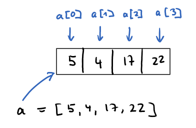

## Arrays

Datenstrukturen sind Sammlungen von Daten zusammen mit darauf definierten Methoden. Eine 
häufig genutzte Datenstruktur ist das Array.

Ein Array stellen wir uns als eine Reihe von Speicherplätzen vor.  Auf die einzelnen Werte greifen wir mit einem Index zu.



``` 
function setup() {
  noCanvas();
  a = [5, 4, 17, 22];
  print(a[0]);
  print(a[2]);
  print(a.length);
}

Ausgabe: 
5
17
4
```

Einige Array-Methoden - siehe auch: [doc](https://developer.mozilla.org/de/docs/Web/JavaScript/Reference/Global_Objects/Array)
```
a = new Array(5);           // Leeres Array mit 5 Elementen - die Werte sind undefined
a = new Array(5).fill(0);   // Array mit 5 Nullen
a.push(4);                  // am Ende was anhängen
a.pop();                    // am Ende was löschen
a.unshift(7);               // am Anfang was anhängen
a.shift();                  // am Anfang was löschen
a.includes(2);              // ist 2 enthalten ?
a.sort();                   // sortieren (inplace)
a.reverse();                // reihenfolge umkehren (inplace)
```

#### Ein Array mit 20 zufälligen ganzen Zahlen von 0-9

```
let a = []
for (let i=0; i<20; i++) {
  a.push(int(random(10)));
}
```
oder
```
let a = new Array(20);
for (let i = 0; i < 20; i++) {
  a[i] = int(random(10));
}
```

#### Farben in einem Array

Ohne Array müssten wir mit `if` und vielen `else-if` die Farbe setzen.


```
let farben = ['#ACD1F2', '#22401E', '#5A8C0F', '#D9D273', '#BF9169']
let i = 0;

function setup() {
  createCanvas(400, 400);
  noStroke();
}

function draw() {
  background(0);

  fill(farben[i]);
  circle(width / 2, height / 2, 200);
}

function mousePressed() {
  i = (i + 1) % farben.length;
}

```
Mit Mausklick wechseln wir zur nächsten Farbe

<iframe src="farben.html" width="420" height="420"></iframe>

---

#### Iteration - ein Array durchlaufen


Mit der for-Schleife durchlaufen wir die Indizes des Arrays. Diese Schleife nutzen wir, wenn
wir den Index der Array-Elemente in unserem Programmablauf benötigen oder wenn wir Elemente im
Array überspringen oder ändern wollen.

```
function setup() {
  noCanvas();
  a = [5, 4, 17, 22];
  for (let i = 0; i < a.length; i++) {
    print(a[i]);
  }
}
```

Mit der for-of-Schleife durchlaufen wir die Werte des Arrays. Diese Schleife nutzen wir, wenn
wir die Elemente des Arrays der Reihe nach lesen wollen.

```
function setup() {
  noCanvas();
  a = [5, 4, 17, 22];
  for (let x of a) {
    print(x);
  }
}
```

#### Farbquadrate mit einer for-Schleife

Die Laufvariable *i* durchläuft die Indizes des Arrays.

```
let farben = ['#ACD1F2', '#22401E', '#5A8C0F', '#D9D273', '#BF9169']

function setup() {
  createCanvas(600, 300);
  noStroke();
}

function draw() {
  background(0);
  let x = 50;
  for (let i=0; i<farben.length; i++) {
    fill(farben[i]);
    rect(x,100,100,100);
    x = x + 100;
  }
}

```

<iframe src="farbquadrate1.html" width="620" height="320"></iframe>

#### Farbquadrate mit einer for-of-Schleife

Die Laufvariable *farbe* durchläuft die Werte des Arrays. Das Ergebnis ist dasselbe wie oben.

```
let farben = ['#ACD1F2', '#22401E', '#5A8C0F', '#D9D273', '#BF9169']

function setup() {
  createCanvas(600, 300);
  noStroke();
}

function draw() {
  background(0);
  let x = 50;
  for (let farbe of farben) {
    fill(farbe);
    rect(x,100,100,100);
    x = x + 100;
  }
}
```

---

#### Zwei Bälle ohne Array

Für jeden Ball benötigen wir drei Variablen, zwei für die Position und eine für die Geschwindigkeit in y-Richtung.

<iframe src="zweiBaelleOhneArray.html" width="420" height="420"></iframe>

``` 
let x0 = 100;        // Ball 0
let y0 = 40;
let vy0 = 3;

let x1 = 300;        // Ball 1
let y1 = 140;
let vy1 = 6;

function setup() {
  createCanvas(400, 400);
  fill(255);
}

function draw() {
  background(0);

  // Ball 0
  if (y0 < 0 || height < y0) {
    vy0 = -vy0
  }
  y0 = y0 + vy0;
  ellipse(x0, y0, 10, 10);
  
  // Ball 1
  if (y1 < 0 || height < y1) {
    vy1 = -vy1
  }
  y1 = y1 + vy1;
  ellipse(x1, y1, 10, 10);

}
```

---

#### Mehrere Bälle mit Arrays

Mit drei Arrays können wir die Daten von vielen Bällen verwalten.

<iframe src="baelleMitArray.html" width="420" height="420"></iframe>


``` 
let x = [100, 300, 200, 350]
let y = [40, 140, 20, 300];
let vy = [3, 6, 1, -7];

function setup() {
  createCanvas(400, 400);
  fill(255);
}

function draw() {
  background(0);
  for (let i = 0; i < x.length; i++) {
    if (y[i] < 0 || height < y[i]) {
      vy[i] = -vy[i]
    }
    y[i] = y[i] + vy[i];
    ellipse(x[i], y[i], 10, 10);
  }
}
```
---

Auch 100 Bälle sind jetzt kein Problem mehr. Für jede weitere Eigenschaft spendieren wir uns ein weiteres Array.

<iframe src="hundertBaelle.html" width="420" height="420"></iframe>

``` 
let anzahl = 100;

let x = new Array(anzahl);
let y = new Array(anzahl);
let vy = new Array(anzahl);
let farbe = new Array(anzahl);

function setup() {
  createCanvas(400, 400);
  colorMode(HSB,360,100,100);
  for (let i=0; i<anzahl; i++) {
    x[i] = int(random(20,width-20));
    y[i] = int(random(20,height-20));
    vy[i] = random(-8,8);
    farbe[i] = int(random(0,360));
  }
}

function draw() {
  background(0);
  for (let i = 0; i < x.length; i++) {
    if (y[i] < 0 || height < y[i]) {
      vy[i] = -vy[i]
    }
    y[i] = y[i] + vy[i];
    fill(farbe[i],100,100);
    ellipse(x[i], y[i], 10, 10);
  }
}

```
---

Die x,y-Koordinaten der Bälle und ihre Geschwindigkeiten in x und y-Richtung werden in Arrays verwaltet.
Solange die Maustaste gedrückt ist, entstehen neue Bälle. Der Hintergrund ist nicht völlig deckend.

Die Systemvariable `mouseIsPressed` ist `true` solange die Maus gedrückt ist.

<iframe src="ballMitMaus.html" width="620" height="620"></iframe>


```
let x = [100, 300]
let y = [30, 80]
let vx = [2, -1];
let vy = [5, -3];

function setup() {
  createCanvas(600, 600);
  noStroke();
}

function draw() {
  background(0, 20);

  fill(255);
  for (let i = 0; i < x.length; i++) {

    if (x[i] < 0 || width < x[i]) {
      vx[i] = -vx[i]
    }
    if (y[i] < 0 || height < y[i]) {
      vy[i] = -vy[i]
    }

    x[i] = x[i] + vx[i];
    y[i] = y[i] + vy[i];

    ellipse(x[i], y[i], 10, 10);
  }

  if (mouseIsPressed) {
    x.push(mouseX)
    y.push(mouseY)

    vx_neu = int(random(2, 5))
    if (random() < 0.5) {
      vx_neu = -vx_neu
    }
    vx.push(vx_neu)

    vy_neu = int(random(1, 5))
    if (random() < 0.5) {
      vy_neu = -vy_neu
    }
    vy.push(vy_neu)
  }
}
```

### Übungen

20 Punkte werden mit Linien verbunden. Bei Mausklick sind es 20 andere Punkte.

<iframe src="zwanzigPunkte.html" width="420" height="420"></iframe>

--- 

Hinher

<iframe src="hinher.html" width="420" height="420"></iframe>

--- 

Quadrate fallen mit unterschiedlicher Geschwindigkeit zu Boden. Mit Mausklick beginnt das Spiel von vorne mit neuen
unterschiedlichen Geschwindigkeiten.

<iframe src="fallendeQuadrate.html" width="520" height="520"></iframe>

---

Linienschlange

Fünf zufällig gesetzte Punkte werden mit Linien zu einer Schlange verbunden. Der erste Punkt wird als
Kopf der Schlange markiert. Mit Mausklick entsteht an der Mausposition eine neuer Kopf und die anderen
Punkte rücken nach. Die Koordinaten der Punkte werden mit zwei Arrays verwaltet.

<iframe src="linienSchlange.html" width="420" height="420"></iframe>

---  

Visible

Die Farbquadrate können mit Mausklick an- und ausgeschaltet werden. Um uns zu merken, ob
ein Quadrat gezeigt werden soll, nutzen wir ein Array mit booleschen Werten.

<iframe src="visible.html" width="620" height="320"></iframe>

Hinweis:
Zu Beginn sollen alle Quadrate gezeigt werden. 
```
let visible = new Array(5).fill(true);
```

Wenn die Maus über dem Quadrat geklickt wird, wird die Sichtbarkeit umgeschaltet.
```
visible[i] = !visible[i];
```

