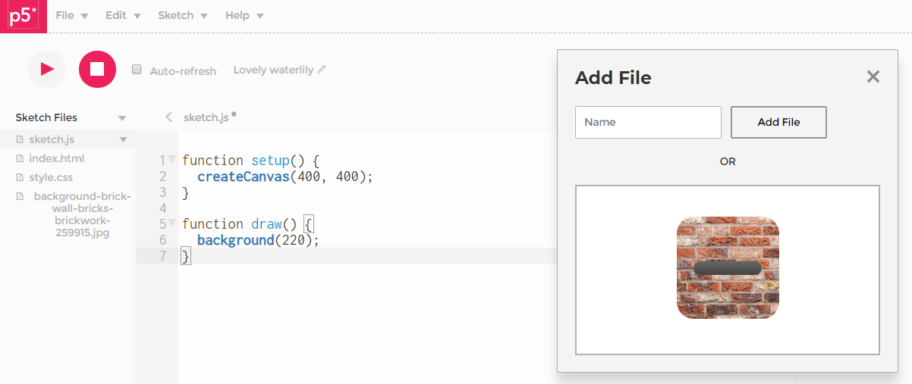

## Bilder

Für Hintergrundbilder eignet sich das *jpg*-Format, für Bilder von Spielfiguren (Sprites) mit transparentem
Hintergrund eignet sich das *png*-Format.
 

-----

Lizenzfreie Bilder können von  [Pexels](https://www.pexels.com/) oder [Unsplash](https://unsplash.com/)  heruntergeladen und dann in den P5-WebEditor geladen werden.


#### Upload in den P5 Webeditor

Die maximale Bildgröße für den Upload in den Webeditor ist **5 MB**. Bei [Pexels] haben wir die
Möglichkeit, beim Download zwischen verschiedenen Größen zu wählen. 

Nach dem Login im P5-Webeditor und dem Klick auf *Sketch, AddFile* haben wir die Möglichkeit, ein Bild in den markierten Bereich zu ziehen oder durch Klick auf den freien Bereich (unterhalb des *OR*) ein File zu wählen.

Wenn wir dann den linken Bereich mit der Fileübersicht aufklappen, sehen wir dort das
hochgeladene Bild und können es ggf umbenennen.



-----

#### Preload

Medien werden in der preload-Funktion geladen. Im Beispiel orientiert sich die Leinwandgröße an der Bildgröße.
Die Koordinaten der *img*-Funktion sind die obere Ecke des Bildes

#### Wall

```
let img;

function preload() {
    img = loadImage("wall.jpg");

}

function setup() {
    createCanvas(img.width, img.height);
}

function draw() {
    image(img, 0, 0);
}
```

<iframe src="wall.html" width="660" height="520"></iframe>

-----

#### Bildgröße in unterschiedlichen Größe anzeigen.

Der *img*-Funktion können wir weitere Koordinaten für die Breite und Höhe des Bildes mitgeben. Wenn 
wir keine Verzerrungen wollen, berechnen wir das Seitenverhältnis aus dem Originalbild.

``` 
let img;

function preload() {
    img = loadImage("wall.jpg");
}

function setup() {
    createCanvas(640, 300);
}

function draw() {
    background(255);

    let sv = img.height / img.width    // Seitenverhältnis
    let bildbreite = 200;
    let bildhoehe = bildbreite * sv;
    image(img, 50, 50, bildbreite, bildhoehe);

    bildbreite = 150;
    bildhoehe = bildbreite * sv;
    image(img, 300, 50, bildbreite, bildhoehe);
}
```

<iframe src="wall02.html" width="660" height="320"></iframe>

---- 

#### Bildgröße ändern

Mit der *resize*-Funktion können wir die Größe des Bildes, das wir in der Variablen gespeichert haben, dauerhaft verändern.

```
let img;

function preload() {
    img = loadImage("wall.jpg");
}

function setup() {
    createCanvas(640, 300);
    let bildbreite = 100;
    img.resize(bildbreite, 0)
}

function draw() {
    background(255);
    image(img, 50, 50);
    image(img, 300, 50);
}

```

<iframe src="wall03.html" width="660" height="320"></iframe>

#### Sprites

Spielfiguren benötigen einen transparenten Hintergrund. Beispiele finden sich [hier](https://ktheu.github.io/InfoAG/medien.html)


```
let img;
let bugImg;
let bugPos;
let bugV;

function preload() {
    img = loadImage("wall.jpg");
    bugImg = loadImage("ladybug_02.png");
}

function setup() {
    createCanvas(img.width, img.height);
    bugPos = createVector(40, height / 2);
    bugV = createVector(2.0, 0);
}

function draw() {
    // check
    if (bugPos.x > width) bugPos.x = -bugImg.width;

    // move
    bugPos.add(bugV);

    // display
    image(img, 0, 0);
    image(bugImg, bugPos.x, bugPos.y)
}
```

<iframe src="bug.html" width="660" height="446"></iframe>

-----


#### Sprites steuern

Das Beispiel zeigt die Übertragung der Navigation aus dem Abschnitt *Kräfte*. Statt mit *circle* einen Ball zu zeichnen, zeigen wir mit *image* ein Bild. Damit sich die Position des Käfers und damit die Rotation auf das Zentrum des Bildes bezieht, schreiben wir *imageMode(CENTER)*. Da die Position des Hintergrundbilds über die linke obere Ecke bestimmt wird, schreiben wir dort *imageMode(CORNER)*.

```
    let img;
    let bugImg;
    let m;

    function preload() {
      img = loadImage("wall.jpg");
      bugImg = loadImage("ladybug_02.png");
    }

    function setup() {
      createCanvas(img.width, img.height);
      m = new Mover();
    }

    function draw() {
      imageMode(CORNER);
      image(img, 0, 0);

      if (keyIsDown(LEFT_ARROW)) m.winkel -= 0.1;
      if (keyIsDown(RIGHT_ARROW)) m.winkel += 0.1;

      if (keyIsDown(87)) {        // Taste w für Schub
        let schub = p5.Vector.fromAngle(m.winkel, 0.2);
        m.applyForce(schub);
      }

      let friction = m.v.copy();  // Reibung
      friction.setMag(-0.05);
      m.applyForce(friction);

      m.act();

    }

    class Mover {

      constructor() {
        this.pos = createVector(30, 30);
        this.v = createVector(0, 0);
        this.a = createVector(0, 0);
        this.winkel = 0;   // Die Ausrichtung des Movers
      }

      applyForce(force) {
        this.a.add(force);
      }

      act() {
        this.check();
        this.move();
        this.display();
      }

      move() {
        this.v.add(this.a);
        this.pos.add(this.v);
        this.a.mult(0);
      }

      display() {
        fill(255);
        stroke(255);
        strokeWeight(2);

        push();
        translate(this.pos.x, this.pos.y)
        rotate(this.winkel);
        imageMode(CENTER);
        image(bugImg, 0, 0);
        pop();
      }

      check() {
        if (this.pos.x > width + 5) this.pos.x = -5;
        if (this.pos.y > height + 5) this.pos.y = -5;
        if (this.pos.x < -5) this.pos.x = width + 5;
        if (this.pos.y < -5) this.pos.y = height + 5;
      }
    }

```


<iframe src="bugLenken.html" width="660" height="446"></iframe>

