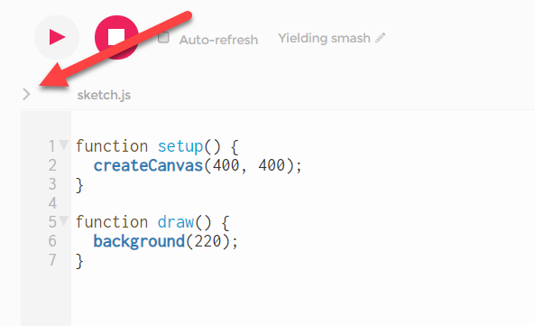
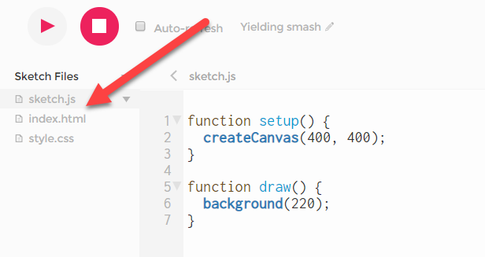
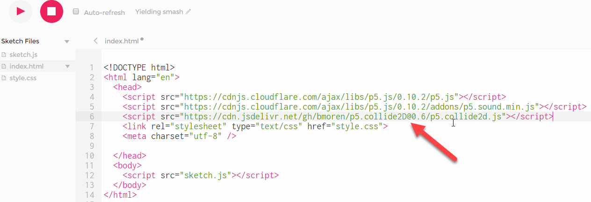

## Collide2D

  <a href="https://github.com/bmoren/p5.collide2D">P5.collide2D</a>
  ist eine Library mit Funktionen zur Kollisionserkennung.


#### Library in den Sketch einfügen

Um sie nutzen zu können, müssen wir zunächst die Library dem Sketch hinzufügen:


1. Klicke auf das *>* Zeichen neben sketch.js


<br><br>

2. Klicke auf *index.html*


<br><br>


3. Füge unter die bestehenden script-Zeilen eine weitere Zeile hinzu:

```
  <script src="https://cdn.jsdelivr.net/gh/bmoren/p5.collide2D@0.6/p5.collide2d.js"></script>

```


-----

#### Kollision Punkt - Rechteck


```
    function setup() {
      createCanvas(200, 200);
      noStroke();
    }

    function draw() {
      background(200);
      hit = collidePointRect(mouseX, mouseY, 50, 50, 100, 100);

      if (hit) {
        fill('red')
      } else {
        fill('green')
      }
      rect(50, 50, 100, 100);
    }
``` 


<iframe src="imRechteck.html" width="220" height="220"></iframe>

#### Kollision Kreis - Rechteck


```
    let rechtecke = [];
    anzRechtecke = 50;

    function setup() {
      createCanvas(1000, 300);
      noStroke();
      for (i = 0; i < anzRechtecke; i++) {
        rechtecke.push(new Rechteck());
      }
    }

    function draw() {
      background(255);

      for (let r of rechtecke) r.act();

      fill(50);
      ellipse(mouseX, mouseY, 20, 20)
    }

    class Rechteck {

      constructor() {
        this.x = random(width);
        this.y = random(height);
        this.w = random(10, 50);
        this.h = random(10, 50);
        this.color = color(random(255), random(255), random(255));
      }

      act() {
        this.check();
        this.move();
        this.display();
      }

      check() {
        let hit = collideRectCircle(this.x, this.y, this.w, this.h, mouseX, mouseY, 20);
        if (hit) this.color = color(0);
      }

      move() {
        this.x += 3
        if (this.x > width) {
          this.x = -this.w;
        }
      }

      display() {
        fill(this.color);
        rect(this.x, this.y, this.w, this.h);
      }
    }


```

<iframe src="kreisUndRechtecke.html" width="1020" height="320"></iframe>

----

#### Kollision Linie - Kreis

```
    function setup() {
      createCanvas(300, 300);
      strokeWeight(5);
    }

    function draw() {
      background(220);
      hit = collideLineCircle(200, 280, 30, 150, mouseX, mouseY, 20);

      if (hit) {
        stroke(0, 255, 0);
      }
      else {
        stroke(255, 0, 0);
      }
      line(200, 280, 30, 150);

      noStroke();
      fill(100);
      circle(mouseX, mouseY, 20);

    }


```

<iframe src="linien.html" width="320" height="320"></iframe>

------

