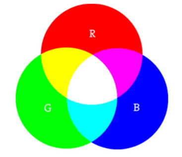
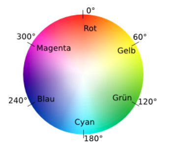

### Farben 

##### RGB

Farben auf dem Bildschirm werden durch Mischung von farbigem Licht erzeugt.
Die drei Grundfarben sind Rot, Grün und Blau.



```
rot + grün = gelb
rot + blau = magenta
blau + grün = cyan
rot + grün + blau = weiß
keine Farben = schwarz
```

Für jede der drei Farben R, G, B wird ein Wert zwischen 0 (keine Farbe) und 255 (volle Farbe) angegeben.

```
function setup() {
  createCanvas(300, 300);
}

function draw() {
  background(217, 152, 14);
  stroke(87, 0, 0);
  fill(163, 25, 27);
 
  strokeWeight(20);
  rectMode(CENTER);
  rect(150, 150, 100, 100);
}
```

<iframe src="rgb.html" width="320" height="320"></iframe>

Die drei RGB-Werte können auch in einen Hex-Wert zusammengefasst werden:

```
fill('#A3251B') statt fill(163,37,27) 
```

Die Mischung einer gewünschten Farbe mittels RGB-Werte ist nicht einfach. Es helfen Color Selektoren und Farbtabellen: 

_[W3C](https://www.w3schools.com/colors/colors_picker.asp)_  -
_[Adobe Color](https://color.adobe.com/de/create/color-wheel/)_

##### HSB

Mit *ColorMode(HSB)* schalten wir in den HSB-Modus, in dem eine Farbe durch die drei Parameter
  *hue* (0-255, Farbton), *saturation* (0-255, Sättigung) und
  *brightness* (0-255 Helligkeit) bestimmt ist.  




Den Wertebereiche können wir anpassen, häufig wird *ColorMode(HSB,360,100,100)* genutzt. Mit
  *ColorMode(RGB,255,255,255)* schalten wir in den default RGB-Modus zurück. 

```
function setup() {
  createCanvas(350, 150);
  noStroke();
}

function draw() {
  
  colorMode(HSB,360,100,100);
  background(100,0,100);
  
  fill(0,100,100);
  circle(50,50,40);
  
  fill(60,100,100);
  circle(100,50,40);
  
  fill(120,100,100);
  circle(150,50,40);
  
  fill(180,100,100);
  circle(200,50,40);
  
  fill(240,100,100);
  circle(250,50,40);
  
  fill(300,100,100);
  circle(300,50,40);
  
  colorMode(RGB,255,255,255);
  
  fill(255,0,0);
  circle(50,100,40);
  
  fill(255,255,0);
  circle(100,100,40);
  
  fill(0,255,0);
  circle(150,100,40);
  
  fill(0,255,255);
  circle(200,100,40);
  
  fill(0,0,255);
  circle(250,100,40);
  
  fill(255,0,255);
  circle(300,100,40);
}

```

<iframe src="hsb.html" width="370" height="170"></iframe>

##### Transparenz

Als vierter Wert kann bei der Festlegung der Farbe der Alpha-Wert mitgegeben werden.
Er bestimmt die Transparenz der Farbe. Der Alpha-Wert 0 bedeutet völlige Transparenz
(keine Deckkraft), 255 bedeutet keine Transparenz (volle Deckkraft) der Farbe.
Bei Grauwerten wird der Alpha-Wert durch einen zweiten Parameter mitgegeben.

```
function setup() {
  createCanvas(300, 300);
}

function draw() {
  background(240);
  
  noStroke();
  fill(163,25,27);
  circle(100,150,100);
  
  stroke(0);
  fill(217,152,14,150);
  circle(150,150,100);
}
```

<iframe src="transparenz.html" width="320" height="320"></iframe>


### Kommentare

Kommentare dienen dazu, dass wir selbst und andere unseren Code verstehen. 
Manchmal setzt man Teile des Programms in Kommentare, um die Ausführung zu verhindern.

* `//` - einzeiliger Kommentar
* `/* ...  */` - mehrzeiliger Kommentar

```
/*
Dieses Programm zeigt die Verwendung der Transparenz
bei Farbwerten. Je höher der Wert, desto höher die Deckkraft -
also desto niedriger die Transparenz.
*/

// setup wird nur einmal durchlaufen
function setup() {
  createCanvas(300, 300);
}

// draw wird immer wieder durchlaufen
function draw() {
  background(240);          // Hintergrundfarbe

  // 1. Kreis
  noStroke();               // keine Umrandung
  fill(163, 25, 27);        // Füllfarbe 
  circle(100, 150, 100);     

  // 2. Kreis
  stroke(0);                // schwarze Umrandung
  fill(217, 152, 14, 150);  // Füllfarbe, nicht ganz deckend
  circle(150, 150, 100);    
}
```

Im P5-Webeditor gibt es den Keyboard-Shortcut `Strg-/` zum Aus- und Einkommentieren von selektiertem Code.
Das funktioniert nur, wenn das  `/`-Zeichen mit der Geteilt-Taste im Nummernblock geschrieben wird, nicht mit der 7er-Taste.

Mit `Tidy-Code` geht leider die vertikale Ausrichtung der Zeilenkommentare verloren.

### Übungen

---

Farbige Quadrate
<iframe src="farbigeQuadrate.html" width="520" height="220"></iframe>

---

Transparente Kreise
<iframe src="transparenteKreise.html" width="270" height="170"></iframe>

---

Buchstabe - der Anfangsbuchstabe deines Names mit einfachen Figuren
<iframe src="buchstabe.html" width="170" height="170"></iframe>

---

Mondrian - Ein Bild in der Art von _[Piet Mondrian](https://de.wikipedia.org/wiki/Piet_Mondrian)_

<iframe src="mondrian.html" width="420" height="420"></iframe>