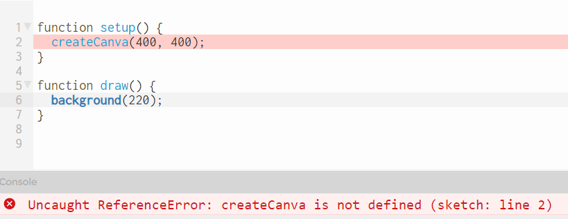

### Fehler

Es gibt drei Arten von Fehlern
- Syntaxfehler, die werden uns angezeigt, ohne das wir das Programm laufen lassen.
- Laufzeitfehler, die werden erst beim  Programmablauf angezeigt.
- logische Fehler, die müssen wir selbst bemerken, z.B: der Kreis ist blau, sollte aber rot sein.

---

Syntaxfehler: Ein Komma fehlt

--- 

Laufzeitfehler: Eine P5JS-Anweisung wurde falsch geschrieben

--- 

Syntaxfehler: eine geschweifte Klammer fehlt

---

Laufzeitfehler: Eine P5JS-Anweisung wurde außerhalb der Funktionen draw und setup geschrieben.

---