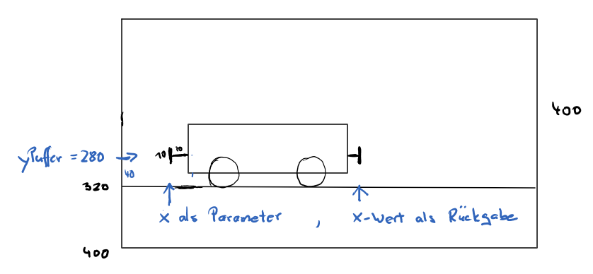

## Funktionen

Mit Funktionen fassen wir Code-Blöcke zu Einheiten zusammen. Funktionen können Parameter erhalten und 
Werte zurückgeben. Ziel ist es, die Einheiten so zu wählen, dass man sie gut testen kann, dass sie wiederverwendbar sind und durch sprechende Namen den Code lesbarer machen.


#### Haus und Sonne 

```
function setup() {
    createCanvas(300, 300);
    noStroke();
}

function draw() {
    background('#31F0FF');
    zeichneHaus();
    zeichneSonne();
}

function zeichneHaus() {
    fill('#FF3134');
    rect(80, 200, 80, 80);
    triangle(80, 200, 160, 200, 120, 150);
}

function zeichneSonne() {
    fill('#FFF931');
    ellipse(200, 100, 80, 80);
}
```

<iframe src="hausUndSonne.html" width="320" height="320"></iframe>

----

#### Gesicht

Die Funktion zeichneGesicht nimmt Parameter für Position, Augen- und Gesichtsfarbe entgegen.

```
function setup() {
    createCanvas(400, 400);
}

function draw() {
    background(255);
    zeichneGesicht(100, 200, '#B03A3A', '#C06AAA');
    zeichneGesicht(300, 100, '#907A37', '#907AFA');
}

function zeichneGesicht(x, y, augenfarbe, gesichtsfarbe) {
    fill(gesichtsfarbe);
    ellipse(x, y, 80, 80); // Gesicht
    fill(augenfarbe);
    ellipse(x - 15, y - 15, 20, 20); // Auge
    ellipse(x + 15, y - 15, 20, 20); // Auge
}
```

<iframe src="gesicht.html" width="420" height="420"></iframe>


---

Funktionen können mit `return` Werte zurückgeben.

```
function setup() {
    createCanvas(400, 400);
}

function draw() {
    background('#B03A3A');
    let y = mausEntfernungZumMittelpunkt();
    displayEntfernung(y);
}

function mausEntfernungZumMittelpunkt() {
    let d = dist(mouseX, mouseY, width / 2, height / 2);
    return d;
}

function displayEntfernung(x) {
    fill(255);
    textSize(30);
    text(int(x), 40, 40);
}
```

<iframe src="entfernungZumMittelpunkt.html" width="420" height="420"></iframe>

---

### Übungen

#### Augen

Implementiere eine Funktion *auge* und zeichne mehrere Augen.

<iframe src="auge.html" width="420" height="420"></iframe>

---

#### Häuser

Implementiere eine Funktion *haus*, die ein Haus mit ein paar Fenstern zeichnet. Bei jedem Mausklick werden die Häuser neu erzeugt.

<iframe src="haus.html" width="620" height="420"></iframe>


----

#### Waggons

Implementiere eine weitere Funktion für einen Waggon. Der y-Wert des Puffers ist festgelegt. Der Funktion wird der x-Wert übergeben, an der der aktuelle Waggon angkoppelt werden soll. Die Funktion gibt den x-Wert zurück, an den der nächste Waggon angekoppelt werden kann.




```
        let yPuffer = 280;
        let xStart = 100;

        function setup() {
            createCanvas(800, 400);
        }

        function draw() {
            background('#F2DEA0');
            fill('#592B02');
            rect(0, height - 80, width, 80);
            let x = xStart
            x = simple_waggon(x);
            x = simple_waggon(x); 
            x = simple_waggon(x);
       
            xStart = xStart - 2;
            if (x < 0) xStart = 800;
        }

        function puffer_vorne(x) {
            strokeWeight(3);
            stroke(0);
            line(x, yPuffer, x + 10, yPuffer);
            line(x, yPuffer - 5, x, yPuffer + 5);
        }

        function puffer_hinten(x) {
            strokeWeight(3);
            stroke(0);
            line(x, yPuffer, x - 10, yPuffer);
            line(x, yPuffer - 5, x, yPuffer + 5);
        }

        function rad(x) {
            fill('#A84F37');
            circle(x, yPuffer + 20, 40);
        }

        function simple_waggon(x) {
            puffer_vorne(x);
            fill('#A6654E')
            rect(x + 10, yPuffer - 100, 300, 120);
            fill('#FBFF87')
            rect(x + 50, yPuffer - 80, 100, 50);   // Fenster
            rect(x + 170, yPuffer - 80, 100, 50);
            puffer_hinten(x + 20 + 300);
            rad(x + 60);
            rad(x + 120);
            rad(x + 200);
            rad(x + 260);
            return x + 20 + 300;
        }

        function my_waggon(x) {
            puffer_vorne(x);
            //
            //  zeichne einen Waggon und gib der Funktion einen
            //  individuellen Namen
            //
            puffer_hinten(x + 20 + 150);
            return x + 20 + 150;
        }
```


<iframe src="waggons.html" width="820" height="420"></iframe>
 