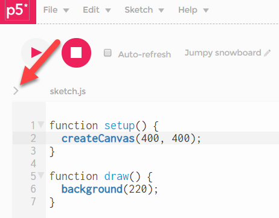

## Gallery

Durch Klick auf `>` neben `sketch.js` sehen wir alle Files des Sketches.




#### Anpassen eines Sketches

Damit unsere Sketche im *Present*-Modus schöner aussehen, ändern wir `style.css`.

`background-color:` - die Farbe des Hintergrunds. <br>
`margin: auto` - Die Leinwand kommt in die horizontale Mitte <br>
`padding-top:` - Abstand der Leinwand von oben.

style.css:
```
html, body {
  margin: 0;
  padding: 0;
  background-color: #1a1a1a;
  padding-top: 100px; 
}
canvas {
  display: block;
  margin: auto;
}
```
 

#### Auflisten der Sketche

Wir erstellen einen Sketch, der nur für die Auflistung unserer Sketche sorgt. 

style.css:

```css
  body {
  line-height: 1.7;
  color: #555753;
  background: #fff;
  margin-top: 50px;
  margin-right: 200px;
  margin-bottom: 50px;
  margin-left: 200px;
  font-family: Verdana, Arial, Helvetica, sans-serif;
  font-size: 100%;
}

p {
  margin-top: 25px;
  text-align: left;
}
``` 

index.html:

```html
<!DOCTYPE html>
<html>

<head>
  <link rel="stylesheet" type="text/css" href="style.css">
  <meta charset="utf-8" />
</head>

<body>
  <h1>My Sketches </h1>
    
  <p>
    <a href="https://editor.p5js.org/ktheu/present/zvsfjrMjg">100 Bälle</a> <br>
    Restart mit Mausklick
  </p>
  
  <p>
    <a href="https://editor.p5js.org/ktheu/present/UNHtXIwlz">Simple Pong</a> <br>
    Pfeiltasten links und rechts für die Balkenbewegung, restart mit Mausklick.
  </p>

</body>

</html>
```

Den Link der Auflistung unter *Share - Present* bitte mir zuschicken.

Beispiel: [MySketches](https://editor.p5js.org/ktheu/present/UNHtXIwlz)
