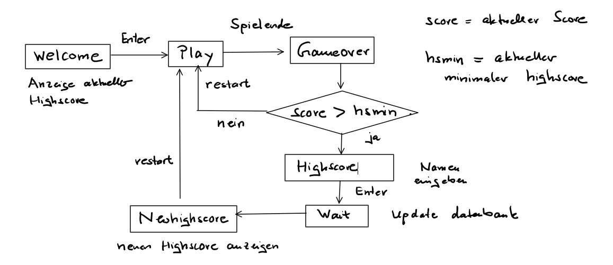

## Glitch

In einem [Glitch](https://glitch.com)-Project können wir einen Node-Server starten, der es erlaubt, Daten zu speichern.

Wir möchten Highscores in einem Spiel zu verwalten.

Muster: [Highscore-Demo](https://highscore-demo.glitch.me/)

Beispiel 1: [SimplePong](https://simplepong.glitch.me/)

Beispiel 2: [Wellen](https://wellen.glitch.me/)

Beispiel 3: [Snake](https://p5snake.glitch.me/)


### Ablauf 

Für ein Projekt mit Highscore nutzen wir insgesamt 6 Spielstati: 

WELCOME, PLAY, GAMEOVER, HIGHSCORE, WAIT, NEWHIGHSCORE





### Eigenes Projekt mit Highscore nach Glitch bringen

1. Remix *highscore-demo*
2. Projektnamen vergeben

Anpassungen in *server.js*

3. *highscoreAnz* anpassen, falls mehr als 3 Highscores angezeigt werden sollen. Nach der Anpassung die Zeile mit *db.remove* aktivieren. Der Server wird dann automatisch neu gestartet und die Datenbank mit der neuen Anzahl angelegt. Dann die Zeile wieder auskommentieren.


Anpassungen in *index.html*

4. Zusätzliche globale Variablen hinzufügen

5. *setup* anpassen. Initialisierungen in setup, die auch beim restart durchgeführt werden sollen, in die Funktion
   *init0* verlegen.

6. Die eigene Spiellogik in die *play*-Funktion bringen.

7. Bei Spielende in den state *GAMEOVER* wechseln. In dem Muster wird das Spielende durch die Leertaste herbeigeführt. Diesen
Code gegebenenfalls entfernen. Eigene Tastensteuerungen einfügen.

```
        if (state === "PLAY") {
          if (key === " ") {
            state = "GAMEOVER";
          }
        }
```

8. Eigene Maussteuerungen einfügen.

9. Schrift, Text, Positionen, etc. in den Funktionen *scoreBackground, highscore, newhighscore, gameover* anpassen.


### Highscore-Demo

Die Anwendung besteht im wesentlichen aus zwei Dateien und einer nedb-Datenbank.

#### sever.js

```
const highscoreAnz = 3;         // Update: Anzahl Highscores

const path = require("path");
const express = require("express");
const bodyParser = require("body-parser");
const Datastore = require("nedb");

const db = new Datastore(".data/highscore.db");
db.loadDatabase();  
// db.remove({}, { multi: true });  
db.count({}, function(err, res) {
  if (res === 0) {
    for (let i = 0; i < highscoreAnz; i++) {
      db.insert([{ name: "N.N", score: 0 }]);
    }
  }
});  

const app = express();
app.use(bodyParser.json());

app.get("/", (req, res, next) => {
  res.sendFile(path.join(__dirname, "./", "views/index.html"));
});

app.get("/highscore", (req, res, next) => {
  db.find({})
    .sort({
      score: -1 // Nach score absteigend sortieren
    })
    .exec(function(err, docs) {
      // docs ist das Array mit den Resultaten der Abfrage
      if (docs.length > highscoreAnz) {
        for (let i = highscoreAnz; i < docs.length; i++) {
          db.remove({ _id: docs[i]._id });
        }
        docs = docs.slice(0, highscoreAnz);
      }
      res.json(docs);
    });
});

app.post("/highscore", (req, res, next) => {
  db.insert(req.body);
  res.redirect("/");
});

app.listen(process.env.PORT);
```

#### views/index.html

```
<html>
  <head>
    <title>Highscore-Demo</title>
    <meta charset="utf-8" />
    <style>
      html,
      body {
        margin: 0;
        padding: 0;
        background-color: #1a1a1a;
        padding-top: 100px;
      }
      canvas {
        display: block;
        margin: auto;
      }
    </style>
    <script src="https://cdnjs.cloudflare.com/ajax/libs/p5.js/0.9.0/p5.js"></script>
    <script>
      let hsmin = -1;
      let highscoreText = "";
      let state = "WELCOME";

      // set in init0
      let score;
      let name;

      function preload() {
        getHighscore();
      }

      function setup() {
        createCanvas(300, 300);
        noStroke();
        init0();
      }

      function draw() {
        background(100);
        switch (state) {
          case "WELCOME":
            welcome();
            break;
          case "PLAY":
            play();
            break;
          case "GAMEOVER":
            gameover();
            break;
          case "HIGHSCORE":
            highscore();
            break;
          case "NEWHIGHSCORE":
            newhighscore();
            break;
          case "WAIT":
            wait();
            break;
        }
      }

      function init0() {
        score = 0;
        name = "";
      }

      function getHighscore() {
        httpGet(
          "/highscore",
          "json",
          false,
          function(res) {
            highscoreText = "Highscore:\n\n";
            for (let i = 0; i < res.length; i++) {
              highscoreText += res[i].name + ": " + res[i].score + "\n";
            }
            hsmin = res[res.length - 1].score;
          },
          function(err) {
            console.log(err);
          }
        );
      }

      function scoreBackground() {
        background(100);
        textSize(30);
        textAlign(CENTER, CENTER);
        text(score, 0, 170, width);

        textAlign(CENTER, CENTER);
        fill(200);
        textSize(14);
        text(highscoreText, 0, 60, width);
      }

      function welcome() {
        scoreBackground();
        text("Welcome to HighNumber", 0, 30, width);
        text("Start with ENTER", 0, 200, width);
      }

      function play() {
        background(100);
        score = int(random(1000));
        textSize(30);
        textAlign(CENTER, CENTER);
        text(score, 0, 170, width);
        textSize(14);
        text("Hit space to stop", 0, 260, width);
      }

      function gameover() {
        if (score > hsmin) {
          state = "HIGHSCORE";
        } else {
          scoreBackground();
          text("Your score: " + score, 0, 230, width);
          text("Press r to restart", 0, 260, width);
        }
      }

      function highscore() {
        scoreBackground();
        text("Your score: " + score, 0, 230, width);
        text("Your name: " + name, 0, 260, width);
      }

      function wait() {
        scoreBackground();
        text("Your Score: " + score, 0, 230, width);
        text("Your Name: " + name, 0, 250, width);
        text("... updating database", 0, 270, width);
      }

      function newhighscore() {
        scoreBackground();
        text("Press r to restart", 0, 260, width);
      }

      function keyTyped() {
        if (state === "HIGHSCORE") {
          name += key;
        }
      }

      function keyPressed() {
        if (state === "WELCOME") {
          if (keyCode === ENTER) {
            state = "PLAY";
          }
        }

        if (state === "PLAY") {
          if (key === " ") {
            state = "GAMEOVER";
          }
        }

        if (state === "GAMEOVER" || state === "NEWHIGHSCORE") {
          if (key === "r") {
            init0();
            state = "PLAY";
          }
        }

        if (state === "HIGHSCORE") {
          if (keyCode === BACKSPACE) name = name.substr(0, name.length - 1);
          if (keyCode === ENTER) {
            state = "WAIT";
            httpPost("/highscore", { name: name, score: score }, function(res) {
              getHighscore();
              state = "NEWHIGHSCORE";
            });
          }
        }
      }
    </script>
  </head>

  <body></body>
</html>

```


 


 

