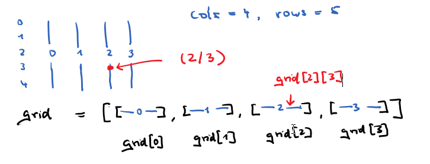

## Raster (Grid)

### Koordinaten

Es gibt verschiedene Möglichkeiten, ein 2-dimensionales Feld mit Indizes zu versehen.

- (1) In der Mathematik befindet sich das Element a<sub>23</sub>
 in der 2.Zeile und 3.Spalte einer Matrix. <br>Die Zählung beginnt bei 1.

- (2) In der Computergrafik befindet sich die Koordinate (2/3)  in der 2.Spalte und 3.Zeile. Die Zählung beginnt bei 0.

Wir organisieren unser Raster nach Methode (2).
Für die Spalten nutzen wir die Variablen i oder x, für die Zeilen die Variablen j oder y.
Je nachdem, welche Schleife wir zuerst ansetzen, durchlaufen wir das Grid entweder spalten- oder zeilenweise.


```
# zeilenweise
let cols = 6;  // Anzahl Spalten
let rows = 4;  // Anzahl Zeilen

function setup() {
  createCanvas(350, 250);
}

function draw() {
  background(220);
  let zaehl = 0;

  for (let y = 0; y < rows; y++) {              # zeile für zeile
    for (let x = 0; x < cols; x++) {
      textAlign(CENTER, CENTER);
      text(str(x) + '/' + str(y) + ' - ' + str(zaehl), x * 50 + 50, y * 50 + 50);
      zaehl++;
    }
  }
}

```
<iframe src="zaehlung01.html" width="370" height="270"></iframe>

----

```
# spaltenweise 
let cols = 6; // Anzahl Spalten
let rows = 4; // Anzahl Zeilen

function setup() {
  createCanvas(350, 250);
}

function draw() {
  background(220);
  let zaehl = 0;
  for (let x = 0; x < cols; x++) {   # spalte für spalte
    for (let y = 0; y < rows; y++) {
      textAlign(CENTER, CENTER);
      text(str(x) + '/' + str(y) + ' - ' + str(zaehl), x * 50 + 50, y * 50 + 50);
      zaehl++;
    }
  }
}

```

<iframe src="zaehlung02.html" width="370" height="270"></iframe>

### 2D-Array

Um Daten für unsere Grid-Positionen abzuspeichern, nutzen wir ein 2D-Array. 
Das 2D-Array ist ein Array von Arrays, genauer: ein Array von Spalten. Die Grid-Einheiten werden häufig Zellen oder Kacheln genannt.



```
    let cols = 6; // Anzahl Spalten
    let rows = 4; // Anzahl Zeilen
    let grid = [];

    function setup() {
      createCanvas(350, 250);
      for (let x = 0; x < cols; x++) {
        grid[x] = [];                    // pro Spalte ein leeres Array
        for (let y = 0; y < rows; y++) {
          grid[x][y] = str(x) + '/' + str(y);
        }
      }
    }

    function draw() {
      background(220);
      for (let x = 0; x < cols; x++) {
        for (let y = 0; y < rows; y++) {
          textAlign(CENTER, CENTER);
          text(str(grid[x][y]), x * 50 + 50, y * 50 + 50);
        }
      }
    }
```

<iframe src="array2d.html" width="370" height="270"></iframe>


Wir lagern die Erstellung des 2D-Arrays in eine Funktion aus, die wir in ähnlichen Situationen wiederverwenden könnnen.
In den 2D-Arrays können wir uns Eigenschaften der Grid-Zellen merken, z.B. ihre Farbe oder ob sie sichtbar sind.


```
let cols = 6; // Anzahl Spalten
let rows = 4; // Anzahl Zeilen

let farbe = make2DArray(cols, rows);
let visible = make2DArray(cols, rows);

function setup() {
  createCanvas(300, 200);
  colorMode(HSB, 360, 100, 100);
  for (let x = 0; x < cols; x++) { // 2D-Array füllen
    for (let y = 0; y < rows; y++) {
      farbe[x][y] = random(200, 260);
      visible[x][y] = true;
    }
  }
}

function draw() {
  background(220);
  let zaehl = 0
  for (let x = 0; x < cols; x++) { // 2D-Array zeigen
    for (let y = 0; y < rows; y++) {
      if (visible[x][y]) {
        fill(farbe[x][y], 100, 100)
        square(x * 50, y * 50, 50);
      }
    }
  }
}

function make2DArray(cols, rows) {
  let arr = new Array(cols);
  for (let x = 0; x < cols; x++) {
    arr[x] = new Array(rows);
  }
  return arr;
}

function mousePressed() {
  let x = int(mouseX / 50);   
  let y = int(mouseY / 50);
  visible[x][y] = !visible[x][y];
}

```
Mit Mausklick schalten wir die Sichtbarkeit der Zelle an und aus.

<iframe src="visible.html" width="320" height="220"></iframe>

#### Schachbrett

Wir berechnen die Größe des Canvas aus den gegebenen Werten.

```
let rows = 8;
let cols = 8;
let groesse = 50;
let cp = 0x265F; // Unicode Codepoint für schwarzer Bauer

board = make2DArray(cols, rows);
visible = make2DArray(cols, rows);

function setup() {
  createCanvas(cols * groesse, rows * groesse);
  background(255);
  strokeWeight(3);
  textSize(30);
  textAlign(CENTER, CENTER);
  for (let x = 0; x < cols; x++) {
    for (let y = 0; y < rows; y++) {
      visible[x][y] = false;
    }
  };
}

function draw() {
  for (let x = 0; x < cols; x++) {
    for (let y = 0; y < rows; y++) {
      fill(255, 127, 36);
      if ((x + y) % 2 == 0) {
        fill(255);
      }
      rect(x * groesse, y * groesse, groesse, groesse);
      if (visible[x][y]) {
        fill(0);
        text(String.fromCodePoint('0x' + cp.toString(16)), (x + 0.5) * groesse, (y + 0.5) * groesse);
      }
    }
  }
}

function make2DArray(cols, rows) {
  let arr = new Array(cols);
  for (let x = 0; x < cols; x++) {
    arr[x] = new Array(rows);
  }
  return arr;
}

function mousePressed() {
  let x = int(mouseX / 50);   
  let y = int(mouseY / 50);
  visible[x][y] = !visible[x][y];
}


```
Mit Mausklick können wir schwarze Bauern setzen und wieder entfernen.

<iframe src="schachbrett.html" width="420" height="420"></iframe>

----

### Tiles

Wenn wir die Kacheln (Tiles) des Rasters als Objekte organisieren, benötigen wir nur ein zweidimensionales Array.
Die jeweiligen Eigenschaften der Kacheln werden in den Objekten gespeichert.

```
    let cols = 30;
    let rows = 30;

    let grid = make2DArray(cols, rows)
    let groesse = 15;

    function setup() {
      createCanvas(cols * groesse + 4, rows * groesse + 4);
      for (let x = 0; x < cols; x++) {
        for (let y = 0; y < rows; y++) {
          grid[x][y] = new Tile(x, y, groesse);
        }
      }
    }

    function draw() {
      background(255);
      for (let x = 0; x < cols; x++) {
        for (let y = 0; y < rows; y++) {
          tile = grid[x][y];
          if (tile.mouseHit() && mouseIsPressed) {
            tile.makeInvisible();
          }
          tile.display();
        }
      }
    }

    function make2DArray(cols, rows) {
      let arr = new Array(cols);
      for (let x = 0; x < cols; x++) {
        arr[x] = new Array(rows);
      }
      return arr;
    }

    class Tile {

      constructor(x, y, groesse) {
        this.x = x;
        this.y = y;
        this.farbe = int(random(50, 180));
        this.groesse = groesse;
        this.visible = true;
      }

      display() {
        if (this.visible) {
          strokeWeight(1);
          colorMode(HSB, 360, 100, 100);
          fill(this.farbe, 100, 100);
          square(this.x * this.groesse, this.y * this.groesse, this.groesse);
        }
      }

      makeInvisible() {
        this.visible = false;
      }

      mouseHit() {
        let x = int(mouseX / this.groesse);
        let y = int(mouseY / this.groesse);
        return x === this.x && y === this.y;
      }
    }

```
Solange die Maus gedrückt ist, entfernen wir an der Mausposition Kacheln.

<iframe src="tiles.html" width="475" height="475"></iframe>


#### Tictactoe

Die Klasse Tile erhält ein Attribute für ein Zeichen.

```
 let groesse = 100;
 let grid = make2DArray(3, 3);

 let playerX = true; // X ist an der Reihe
 let gewinn = '#FFB03B'; // Farbe für die Gewinnfelder

 function setup() {
   createCanvas(3 * groesse + 4, 3 * groesse + 4);
   for (let x = 0; x < 3; x++) {
     for (let y = 0; y < 3; y++) {
       grid[x][y] = new Tile(x, y, groesse);
     }
   }
 }

 function draw() {
   check();
   for (let x = 0; x < 3; x++) {
     for (let y = 0; y < 3; y++) {
       grid[x][y].display();
     }
   }
 }

 function mousePressed() {
   let x = int(mouseX / groesse);
   let y = int(mouseY / groesse);
   let tile = grid[x][y];
   if (!tile.zeichen) {
     tile.zeichen = playerX ? 'X' : 'O';
     playerX = !playerX;
   }
 }

 function check() {

   for (let k = 0; k < 3; k++) {
     let zeile = grid[k][0].zeichen + grid[k][1].zeichen + grid[k][2].zeichen;
     if (zeile === 'XXX' || zeile === 'OOO') {
       grid[k][0].farbe = gewinn;
       grid[k][1].farbe = gewinn;
       grid[k][2].farbe = gewinn;
       noLoop();
     }
     let spalte = grid[0][k].zeichen + grid[1][k].zeichen + grid[2][k].zeichen;
     if (spalte === 'XXX' || spalte === 'OOO') {
       grid[0][k].farbe = gewinn;
       grid[1][k].farbe = gewinn;
       grid[2][k].farbe = gewinn;
       noLoop();
     }
   }
   let diagonale1 = grid[0][0].zeichen + grid[1][1].zeichen + grid[2][2].zeichen;
   if (diagonale1 === 'XXX' || diagonale1 === 'OOO') {
     grid[0][0].farbe = gewinn;
     grid[1][1].farbe = gewinn;
     grid[2][2].farbe = gewinn;
     noLoop();
   }

   let diagonale2 = grid[2][0].zeichen + grid[1][1].zeichen + grid[0][2].zeichen;
   if (diagonale2 === 'XXX' || diagonale2 === 'OOO') {
     grid[0][2].farbe = gewinn;
     grid[1][1].farbe = gewinn;
     grid[2][0].farbe = gewinn;
     noLoop();
   }
 }

 function make2DArray(cols, rows) {
   let arr = new Array(cols);
   for (let x = 0; x < cols; x++) {
     arr[x] = new Array(rows);
   }
   return arr;
 }

 class Tile {

   constructor(x, y, groesse) {
     this.x = x;
     this.y = y;
     this.groesse = groesse;
     this.farbe = '#FFF0A5';
     this.zeichen = null;
   }

   display() {
     strokeWeight(2);
     fill(this.farbe);
     stroke('#8E2800') // Farbe für den Kachel-Rand
     rect(2 + this.x * this.groesse, 2 + this.y * this.groesse, this.groesse, this.groesse);
     if (this.zeichen !== null) {
       fill('#468966'); // Farbe für das Zeichen
       noStroke();
       textAlign(CENTER, CENTER);
       textSize(this.groesse * 0.7);
       text(this.zeichen, (this.x + 0.5) * this.groesse, (this.y + 0.6) * this.groesse);
     }
   }
 }

```

<iframe src="tictactoe.html" width="324" height="324"></iframe>

---