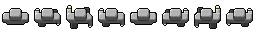
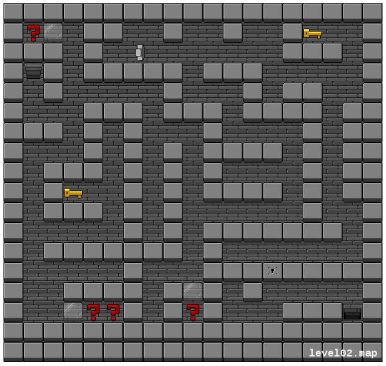
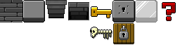

## Sprites

Der Begriff Sprite wird für Objekte benutzt, die per Software über den Hintergrund eingeblendet werden.

Sammlungen von Sprites finden sich bei [opengameart.org](https://opengameart.org/) (Lizenzbedingungen beachten).

### Spritesheets

Die Einzelbilder für animierte Sprites werden häufig in Spritesheets zusammengefasst. Dieses Spritesheet umfasst 8 Einzelbilder im Format 32x32.




<sub> by Xevin in [operngameart.org](https://opengameart.org/content/walk-animation) </sub>

Das Spritesheet wird in *preload* geladen und in *setup* in die einzelnen Bestandteile aufgeteilt.


```
    let sheet;
    let images = [];

    function preload() {
      sheet = loadImage('hero_a.png');
    }

    function setup() {
      createCanvas(200, 200);
      for (let x = 0; x < 8 * 32; x += 32) {
        let img = sheet.get(x, 0, 32, 32);
        images.push(img);
      }
    }

    function draw() {
      background(220);
      let tempo = int(frameCount * 0.2);
      image(images[tempo % 8], 100, 100);
    }

```

<iframe src="hero_a.html" width="220" height="220"></iframe>


### Gameboard mit Sprites

Wir möchten die folgende Spielfläche nachbilden:

 


Dazu nutzen wir ein Spritesheet:



<sub> by Xevin in [operngameart.org](https://opengameart.org/content/simple-tileset) </sub>

Zunächst bilden wir die Spielfläche in einem Textfile nach, mit geeigneten Zeichen für die verschiedenen Tiles:

```
xxxxxxxxxxxxxxxxxxx
x?D xx  x  x  xS  x
xxx x         xxx x
xTx xxxxx xxx     x
x x     x   x xx  x
x   xxx xxx xxxx xx
xxx x x   x    x xx
x   x x x xxxx x xx
x xxx x x x    x xx
x xS  x x xxxx x xx
x xxx x x      x  x
x     x x xxxxxxx x
x xxxxxxx x       x
x     x   xxxxxxxxx 
x  xxxx xDx x     x 
x  D??x x?x   xxxTx 
xxxxxxxxxxxxxxxxxxx
xxxxxxxxxxxxxxxxxxx

? = Fragezeichen
S = Schlüssel
T = Treppe
D = Durchgang
```

Die Funktion *loadStrings* liest jede Zeile als String ein. Unser 2D-Array ist ein Array von Spalten. Das müssen wir beim Zuweisen der Arraywerte beachten. Wir kontrollieren durch eine einfache Ausgabe.

```
    let map = [];
    let cols, rows;
    let gridmap;

    function preload() {
      map = loadStrings('map01.txt');
    }
  
    function setup() {
      createCanvas(400, 400);
      let map0 = []      // keine Leerzeilen oder Leerzeichen am Ende

      for (let s of map) {
        s = s.trim();
        if (s.length > 0)  map0.push(s);  
      }

      cols = map0[0].length;
      rows = map0.length;
 
      gridmap = make2DArray(cols, rows);

      for (let x=0; x < cols; x++) {
        for (let y=0; y < rows; y++) {
          gridmap[x][y] = map0[y][x];
        }
      }
    }

    function draw() {
      background(255);
      for (let x = 0; x < cols; x++) {
        for (let y = 0; y < rows; y++) {
          textSize(20);
          text(gridmap[x][y], 20+x*20, 20+y*20)
        }
      }
    }

    function make2DArray(cols, rows) {
      let arr = new Array(cols);
      for (let x = 0; x < cols; x++) {
        arr[x] = new Array(rows);
      }
      return arr;
    }
```

<iframe src="readMap" width="420" height="420"></iframe>

--- 


Die Figur wird mit den Tasten *w, a, s, d* gesteuert. Es ist bisher nur die Bewegung durch das Maze realisiert. 

<iframe src="tiles04.html" width="628" height="596"></iframe>


```
    class Player {

      constructor(pos) {
        this.pos = pos;
        this.winkel = 0;
      }

      display() {
        push()
        translate(this.pos.x+16,this.pos.y+16);
        rotate(radians(this.winkel));
        let tempo = int(frameCount * 0.2);
        image(hero_images[tempo % 8], -16, -16);
        pop();
      }

      move() {
        let x = this.pos.x;
        let y = this.pos.y;

        if (keyIsDown(UP_ARROW) && (validSquare(x, y - v))) {
          this.pos.y -= v;
          this.winkel = 0;
        }
        if (keyIsDown(DOWN_ARROW) && (validSquare(x, y + v))) {
          this.pos.y += v;
          this.winkel = 180;
        }
        if (keyIsDown(LEFT_ARROW) && (validSquare(x - v, y))) {
          this.pos.x -= v;
          this.winkel = -90;
        }
        if (keyIsDown(RIGHT_ARROW) && (validSquare(x + v, y))) {
          this.pos.x += v;
          this.winkel = 90;
        }
      }
    }

    let map = [];
    let cols, rows;
    let gridmap;

    let sheet;
    let images = []

    let hero_sheet;
    let hero_images = [];
    let tileSize = 32;

    let player;
    let v = 1.2;

    function preload() {
      sheet = loadImage('default_tiles_x.png');
      map = loadStrings('map01.txt');
      hero_sheet = loadImage('hero_a.png');
    }

    function setup() {

      for (let x = 0; x < 8 * 32; x += 32) {
        let img = sheet.get(x, 0, 32, 32);
        images.push(img);
      }
      images.push(sheet.get(4 * 32, 32, 32, 32));
      images.push(sheet.get(5 * 32, 32, 32, 32));

      for (let x = 0; x < 8 * 32; x += 32) {
        let img = hero_sheet.get(x, 0, 32, 32);
        hero_images.push(img);
      }

      //randomSeed(42);
      let map0 = []      // no empty Strings and no whitespace at end

      for (let s of map) {
        s = s.trim();
        if (s.length > 0) map0.push(s);
      }

      cols = map0[0].length;
      rows = map0.length;
      createCanvas(cols * tileSize, rows * tileSize);

      gridmap = make2DArray(cols, rows);

      for (let x = 0; x < cols; x++) {
        for (let y = 0; y < rows; y++) {
          gridmap[x][y] = map0[y][x];
        }
      }

      player = new Player(createVector(5*tileSize, 4*tileSize));

    }

    function draw() {
      background(0);
      for (let x = 0; x < cols; x++) {
        for (let y = 0; y < rows; y++) {

          if (gridmap[x][y] === 'x') {
            image(images[1], x * tileSize, y * tileSize)
          }
          else image(images[0], x * tileSize, y * tileSize)

          if (gridmap[x][y] === 'S') {
            image(images[4], x * tileSize, y * tileSize)
          }
          if (gridmap[x][y] === '?') {
            image(images[7], x * tileSize, y * tileSize)
          }
          if (gridmap[x][y] === 'D') {
            image(images[6], x * tileSize, y * tileSize)
          }
          if (gridmap[x][y] === 'T') {
            image(images[2], x * tileSize, y * tileSize)
          }
        }
      }

      player.move();
      player.display();
    }

    function make2DArray(cols, rows) {
      let arr = new Array(cols);
      for (let x = 0; x < cols; x++) {
        arr[x] = new Array(rows);
      }
      return arr;
    }

    function validSquare(xc,yc) {
      // checks if square is within free area
      let size = 0.8*tileSize;
      return free(xc+5,yc+5) && free(xc+size,yc+5) &&
             free(xc+5,yc+size) && free(xc+size,yc+size)
    }

    function free(xc, yc) {
      let xm = int(xc / tileSize);
      let ym = int(yc / tileSize);
      return gridmap[xm][ym] === ' ';
    }
```


