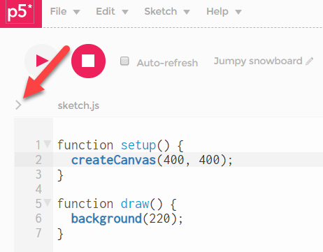

## P5 WebEditor

#### Der Present-Modus

Unter *File, Share, Present* können wir den Sketch im *present-Modus* anschauen.  
Um die Leinwand mittig zu platzieren und evtl. eine andere Hintergrundfarbe zu wählen, machen wir Anpassungen:

Durch Klick auf `>` neben `sketch.js` sehen wir alle Files des Sketches.



Wir ändern `style.css`.

`background-color:` - die Farbe des Hintergrunds. <br>
`margin: auto` - Die Leinwand kommt in die horizontale Mitte <br>
`padding-top:` - Abstand der Leinwand von oben.

style.css:
```
html, body {
  margin: 0;
  padding: 0;
  background-color: #1a1a1a;
  padding-top: 100px; 
}
canvas {
  display: block;
  margin: auto;
}
```

----- 
 


