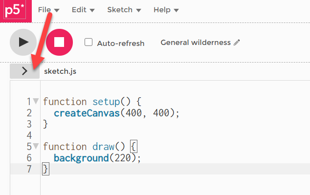

## P5 WebEditor

#### Der Present-Modus

Unter *File, Share, Present* können wir den Sketch im *present-Modus* anschauen.  
Um die Leinwand mittig zu platzieren und evtl. eine andere Hintergrundfarbe zu wählen, machen wir Anpassungen:

Durch Klick auf `>` neben `sketch.js` sehen wir alle Files des Sketches.



Wir fügen die Zeilen mit den Kommentaren in `style.css` ein und passen die Werte an.

```
html, body {
  margin: 0;
  padding: 0;
  background-color: #1a1a1a;  /* <--- update: Hintergrundfarbe */
  padding-top: 100px;         /* <--- update: Abstand nach oben */
}
canvas {
  display: block;
  margin: auto;               /* Leinwand mittig */
}
```

 
 


