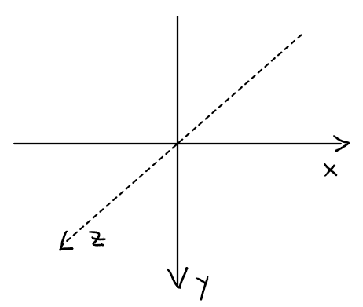

## WegGL

*OpenGL* (Open Graphics Library) ist eine Spezifikation (API) zur Entwicklung von
2D- und 3D-Computergrafikanwendungen. Der OpenGL-Standard beschreibt etwa 250 Befehle, die die Darstellung komplexer 3D-Szenen in Echtzeit erlauben.

*WebGL* ist eine Übertragung der OpenGL Standards für Javascript. [Three.js](https://threejs.org/) 
ist eine Bibliothek, die diese   Standards implementiert.

p5.js enthält Methoden zur einfachen Nutzung von WebGL. 

#### 3D-Koordinaten

Der Ursprung des 3D-Canvas ist nicht mehr oben links, sondern in der Mitte. 




#### Rotation 

Mit *rotateX(), rotateY(), rotateZ()* können wir um die Achsen rotieren. 
*rotateZ()* entspricht der Rotation in einem 2D-Kontext.

```
    let winkel = 0;

    function setup() {
      createCanvas(300, 300, WEBGL);
    }
    function draw() {
      background(200);
      rotateX(winkel);  // rotateY, rotateZ
      rectMode(CENTER);
      fill(0, 0, 255);
      rect(0, 0, 150, 100);
      winkel += 0.03;
    }
```
 
 
<iframe src="rechteckX.html" width="320" height="320" ></iframe>
<iframe src="rechteckY.html" width="320" height="320" ></iframe>
<iframe src="rechteckZ.html" width="320" height="320" ></iframe>

----

#### Rotationen um alle Achsen 

```
    let winkel = 0;

    function setup() {
      createCanvas(300, 300, WEBGL);
    }
    function draw() {
      background(200);
      rotateX(winkel * 0.7);
      rotateY(winkel * 0.3);
      rotateZ(winkel);
      rectMode(CENTER);
      fill(0, 0, 255);
      rect(0, 0, 150, 100);
      winkel += 0.02;
    }
```
 
<iframe src="rotationen.html" width="320" height="320" ></iframe>

----

#### 3D-Primitives 

Es gibt sieben 3D-Primitives: plane, box, sphere, cylinder, cone, ellipsoid, torus.

```
    let winkel = 0;

    function setup() {
      createCanvas(300, 300, WEBGL);
    }
    function draw() {
      background(200);
      rotateX(winkel * 0.9);
      rotateY(winkel * 0.8);
      rotateZ(winkel);
      rectMode(CENTER);
      fill(0, 0, 255);
      winkel += 0.01;

      plane(80,140);
      // box(40,100,150);
      // sphere(100);
      // cylinder(100,70);
      // cone(100,70);
      // ellipsoid(100,40,70);
      // torus(90,20);
    }

```

<iframe src="plane.html" width="320" height="320" ></iframe>
<iframe src="box.html" width="320" height="320" ></iframe>
<iframe src="sphere.html" width="320" height="320" ></iframe>
<iframe src="cylinder.html" width="320" height="320" ></iframe>
<iframe src="cone.html" width="320" height="320" ></iframe>
<iframe src="ellipsoid.html" width="320" height="320" ></iframe>
<iframe src="torus.html" width="320" height="320" ></iframe>

----


#### Translate

Um ein Objekt an eine bestimmte Stelle zu positionieren, benötigen wir *translate*.

```
    function setup() {
      createCanvas(300, 300, WEBGL);
    }
    function draw() {
      background(230);
      strokeWeight(4);

      winkelX = map(mouseX, 0, width, -HALF_PI, HALF_PI);
      winkelY = map(mouseY, 0, width, -HALF_PI, HALF_PI);

      // blaue Box am Ursprung
      push();
      fill(0, 0, 255);
      rotateX(winkelX);
      rotateY(winkelY);
      box(40, 40);
      pop();

      // rote Box versetzt
      push();
      fill(255, 0, 0);
      translate(-100, -100, 0);
      rotateX(winkelX);
      rotateY(winkelY);
      box(40, 40);
      pop();
    }

```
 
<iframe src="translate.html" width="320" height="320" ></iframe>

----

#### Material und Light 

*Material* beschreibt, wie die Oberfläche eines Objekts im Licht erscheint. In der 2D-Welt
bestimmen wir das Erscheinen eines Pixels mit seiner Farbe. In der 3D-Welt bestimmen wir die Erscheinung
dadurch, dass wir festlegen, welches Material von welchem Licht beschienen wird.

#### normalMaterial

*normalMaterial* ist unabhängig vom Licht. Die Oberfläche eines 3D-Primitives setzt sich aus vielen
 kleinen Dreiecken zusammen. Der Normalenvektor auf dem Dreieck bestimmt die r,g,b - Werte der Färbung.
 Im Beispiel ist die Oberfläche dann blau, wenn der Normalvektor mit Richtung (0,0,1) auf den Betrachter zeigt.

 ```
    let winkel = 0;

    function setup() {
      createCanvas(300, 300, WEBGL);
    }
    function draw() {
      background(230);

      push();
      normalMaterial();
      rotateX(winkel);
      rotateY(winkel);
      rotateZ(winkel);
      
      box(40, 40);
      stroke(0);
      line(0, 0, 0, 70, 0, 0);

      push();
      translate(70, 0, 0);
      rotateZ(-HALF_PI);
      cone(5, 10);
      pop();

      pop();
      winkel += 0.02;
    }

 ```

<iframe src="normalMaterial.html" width="320" height="320" ></iframe>

----

#### ambientMaterial und ambientLight
 
 Die Parameter des *ambientMaterial* bestimmen, welches Licht das Material
  reflektieren kann. *ambientLight* setzt ein gleichmäßiges Umgebungslicht.
  Im Beispiel wird mit mouseX der Blauanteil des Lichts gesteuert. Ist dieser Null, dann erscheint
  der Torus schwarz, weil er nur blaues Licht reflektieren kann.

```
    let winkel = 0;

    function setup() {
      createCanvas(300, 300, WEBGL);
    }
    function draw() {
      background(230);
      let lightB = map(mouseX, 0, width, 0, 255);

      push();
      ambientLight(255, 0, lightB);
      ambientMaterial(255, 0, 0);
      rotateX(winkel);
      rotateY(winkel);
      rotateZ(winkel);
      box(40, 40);
      pop();

      push();
      ambientLight(255, 0, lightB);
      ambientMaterial(0, 0, 255);
      rotateX(winkel * 1.3);
      rotateY(winkel * 0.5);
      rotateZ(winkel * 0.5);
      torus(80, 10);
      pop();
      winkel += 0.02;
    }

```
 
  <iframe src="ambientMaterial.html" width="320" height="320" ></iframe>
</p>
 
 ----

 #### directionalLight

 
*directionalLight* scheint aus einer Richtung (Quelle ziemlich weit weg, wie die Sonne).
Im Beispiel scheint ein rotes directionalLight aus Richtung (-10, 0,-7), ein grünes
aus Richtung (1, 2,-3). 

```
    let winkel = 0;

    function setup() {
      createCanvas(300, 300, WEBGL);

    }
    function draw() {
      background(200);

      directionalLight(255, 0, 0, -10, 0, -7);
      directionalLight(0, 255, 0, 1, 2, -3);

      rotateX(winkel * 0.9);
      rotateY(winkel * 0.8);
      rotateZ(winkel);

      sphere(80);
      winkel += 0.01;
    }

```
<p>
  <iframe src="directionalLight.html" width="320" height="320" ></iframe>
</p>

----


#### Texture 

Statt einem Material können wir auch Textures verwenden und die Oberfläche mit einem Bild, einem Film, oder einem
Text versehen. 

```
    let winkel = 0;
    let img;

    function preload() {
      img = loadImage('stifts.png');
    }

    function setup() {
      createCanvas(300, 300, WEBGL);
    }
    
    function draw() {
      background(200);

      texture(img);
      rotateX(winkel * 0.9);
      rotateY(winkel * 0.8);
      rotateZ(winkel);

      box(150);
      winkel += 0.01;
    }

```

<iframe src="bildTexture.html" width="320" height="320" ></iframe>
<iframe src="textTexture.html" width="320" height="321" ></iframe>
 